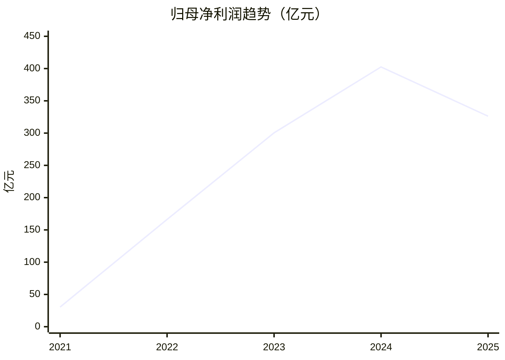
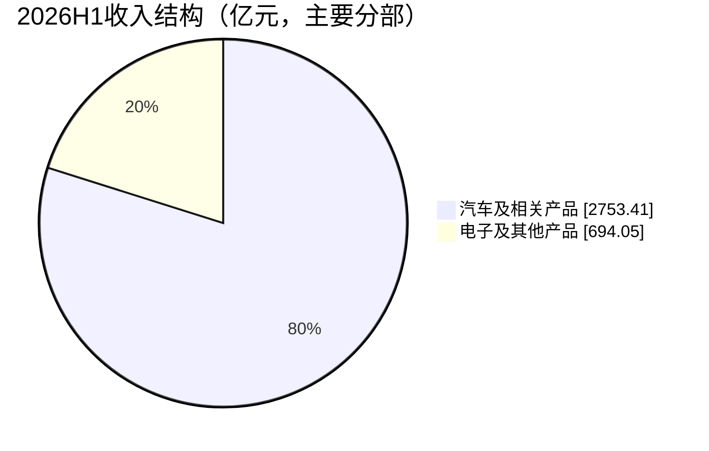

# 比亚迪（002594.SZ / 01211.HK）研究报告

> 研究日期：2026年9月11日；资料截止：当日研究时可取得的公开披露。财务截至2026年6月30日，销量截至2026年8月。  
> 价格基准：2026年9月10日完整收盘，A股83.52元，H股79.55港元；不使用9月11日盘中价格。  
> A股价格隐含全公司市值7614.68亿元，H股价格隐含全公司市值7252.73亿港元；分别约25.87倍、21.29倍重算TTM市盈率。  
> 研究主线：比亚迪的制造与成本优势仍在，但股东回报取决于海外增长能否覆盖国内竞争、汇兑损失和持续再投资。

---

## AI研究偏见自觉

**信息丰富度：A级。** 年报、产销公告与市场评论丰富，最大的陷阱是把“技术强、销量大、全球化”直接等同于“股东能持续拿到现金”。

AI研究局限性声明：公开资料能确认报表与批发销量，不能直接确认经销商真实库存、海外各工厂资本回报或产品全生命周期质保成本。本文的估值增长率、终值倍数及风险等级都是分析假设，不是公司指引，也不是四位投资者本人观点。

- [x] 将资料丰富度与现金流确定性分开判断。
- [x] 同时检查二季度修复和半年度下降，避免只挑支持单一方向的数据。
- [x] 不把厂家技术宣传、出口数量、渠道预收款当作已经实现的股东收益。
- [x] 不沿用仓库旧报告中的价格、股本与估值结论；旧文件保持原样。

## 第一步：核心数据总览

### 五年财务：利润扩张之后，现金流先承压

单位：人民币亿元；比例由原始报表精确计算后四舍五入。归母净利润不含少数股东损益。营业利润率为中国会计准则营业利润/收入，包含其他收益、投资收益等，不等于纯制造业务EBIT率。

| 指标 | 2021 | 2022 | 2023 | 2024 | 2025 |
|---|---:|---:|---:|---:|---:|
| 营业收入 | 2161.42 | 4240.61 | 6023.15 | 7771.02 | 8039.65 |
| 归母净利润 | 30.45 | 166.22 | 300.41 | 402.54 | 326.19 |
| 综合毛利率 | 13.02% | 17.04% | 20.21% | 19.44% | 17.74% |
| 营业利润率 | 2.14% | 5.08% | 6.33% | 6.50% | 5.00% |
| 归母净利率 | 1.41% | 3.92% | 4.99% | 5.18% | 4.06% |
| 经营现金流 | 654.67 | 1408.38 | 1697.25 | 1334.54 | 591.36 |
| 现金资本开支 | 373.44 | 974.57 | 1220.94 | 973.60 | 1568.08 |
| 简化自由现金流 | 281.23 | 433.81 | 476.32 | 360.94 | -976.72 |
| 货币资金 | 504.57 | 514.71 | 1090.94 | 1027.39 | 754.25 |

自由现金流统一为“经营现金流－购建固定资产、无形资产和其他长期资产支付的现金”，不扣减处置资产回款，不含收购；也不是严格的普通股FCFE。2025年经营性应付项目现金流调整为-371.98亿元，2024年为+675.60亿元：供应链和营运资金变化是现金流下降的重要原因，不能只归因于利润下滑。

来源：[2021年报](https://www1.hkexnews.hk/listedco/listconews/sehk/2022/0329/2022032902340_c.pdf)、[2023年报](https://www.hkexnews.hk/listedco/listconews/sehk/2024/0326/2024032602309_c.pdf)、[2025年报](https://www.hkexnews.hk/listedco/listconews/sehk/2026/0327/2026032702970_c.pdf)。交叉录入核对：[五年利润表](https://www.yingman.com/stock/002594/lirunbiao/)、[现金流量表](https://www.yingman.com/stock/002594/xianjinliu/)、[资产负债表](https://www.yingman.com/stock/002594/fuzhaibiao/)；最新年度另核对[东方财富](https://finance.eastmoney.com/a/202603283687762480.html)。盈慢网来源透明度较低，只作为报表数字的第二录入源，不代表独立审计。



### 最新半年：毛利率改善，净利仍下降

| 指标 | 2026H1 | 对照或解释 |
|---|---:|---|
| 收入 | 3448.15亿元 | 同比-7.13% |
| 归母净利润 | 123.25亿元 | 同比-20.54% |
| 扣非归母净利润 | 123.73亿元 | 同比-9.02% |
| 综合毛利率 | 18.85% | 集团口径，不是“国内毛利率” |
| 经营现金流 | 373.35亿元 | 上年同期318.33亿元 |
| 现金资本开支 | 447.03亿元 | 上年同期805.25亿元 |
| 简化自由现金流 | -73.68亿元 | 改善但仍未转正 |
| 研发投入 | 288.61亿元 | 利润表研发费用233.07亿元，两者不可互换 |
| 存货 | 1899.91亿元 | 较年末1384.21亿元增长37.26% |
| 合同负债 | 797.97亿元 | 年末514.71亿元，预收款支持现金流，也意味着未来交付义务 |

财务费用从上年同期-32.47亿元变成50.96亿元，差额83.43亿元；公司解释主要为汇兑损失与上年汇兑收益的反向变化。这是净利与毛利走势分化的重要因素，不能把全部利润下降解释成价格战，也不能假定汇兑损失以后必然转回。[半年报全文](https://money.finance.sina.com.cn/corp/view/vCB_AllBulletinDetail.php?id=12572791&stockid=002594)、[独立财经报道交叉核对](https://stock.stockstar.com/IG2026082900015677.shtml)。

### 四个季度：二季度修复有证据，但仍需持续性验证

| 单季 | 营业收入（亿元） | 归母净利润（亿元） |
|---|---:|---:|
| 2025Q3 | 1949.85 | 78.23 |
| 2025Q4 | 2376.99 | 92.86 |
| 2026Q1 | 1502.25 | 40.85 |
| 2026Q2 | 1945.90 | 82.41 |

2026Q2由半年报减一季报得到，归母净利润同比+29.66%。滚动十二个月收入7774.99亿元，归母净利润294.34亿元，公式为2025全年－2025上半年＋2026上半年。**二季度修复与上半年承压同时成立。** 最近四个单季度完整分部收入、分部毛利率未全部取得，不用年度占比机械分摊。[2025年报](https://www.hkexnews.hk/listedco/listconews/sehk/2026/0327/2026032702970_c.pdf)、[2026一季报](https://static.cninfo.com.cn/finalpage/2026-04-29/1225233071.PDF)、上述半年报。

> 段永平式追问：如果销量不再高速增长，这些利润能有多少真正留给股东？

---

## 第二步：生意本质分析

**比亚迪把电池、电驱、整车和制造组织整合起来，为消费者提供更低综合使用成本的汽车，再靠持续换代和规模制造反复取得订单。**

汽车仍以一次性交易为主。维修、售后与用户复购有价值，但目前不能据此给予订阅软件估值。电子业务服务大客户，订单具有持续性，议价权却受客户集中和制造替代能力制约。

| 分部/地区 | 2025收入（亿元） | 2025毛利率 | 2026H1收入（亿元） | 2026H1毛利率 |
|---|---:|---:|---:|---:|
| 汽车、汽车相关产品及其他产品 | 6486.46 | 20.49% | 2753.41 | 22.33% |
| 电子及其他产品 | 1552.37 | 6.29% | 694.05 | 5.04% |
| 中国（包括港澳台） | 4932.24 | 16.66% | 1635.47 | 15.67% |
| 境外 | 3107.41 | 19.46% | 1812.68 | 21.71% |

分部与地区是两套交叉维度，不能相加；少量其他收入使两大分部之和与集团收入存在尾差。境外收入包含电子业务，**不能直接叫汽车出口收入**。[2025年报](https://www.hkexnews.hk/listedco/listconews/sehk/2026/0327/2026032702970_c.pdf)、[2026半年报](https://money.finance.sina.com.cn/corp/view/vCB_AllBulletinDetail.php?id=12572791&stockid=002594)。



真正决定利润的变量有三项：车型及地区组合带来的售价与毛利；工厂利用率、零部件自制率带来的单位成本；研发、渠道、汇率与售后费用对毛利的消耗。自制降低外购加价，但把供应商原本承担的固定资产和技术淘汰风险收回公司内部。规模越大，利用率下降的成本也越大。

同业参照：吉利2026H1集团毛利率17.9%，与比亚迪集团18.85%相近；但比亚迪汽车分部22.33%与其集团口径并不完全可比，不能直接相减宣称纯汽车成本领先幅度。[吉利业绩报道](https://www.jjckb.cn/20260817/4f18f5e437704044ab240cbf11261622/c.html)。

> 段永平式追问：这门生意好在哪？答案是规模化工程和成本组织能力；难点是这些优势能否转成无需反复融资的股东现金。

---

## 第三步：护城河评估

| 来源 | 判断 | 支持与反证 | 未来可证伪信号 |
|---|---|---|---|
| 品牌与定价权 | 中等，分品牌 | 技术与可靠性形成认知；国内毛利下降提示普遍提价能力有限 | 维持销量必须持续加大折扣 |
| 转换成本 | 低 | 换车本来就是低频决策，用户可以换品牌 | 竞品热销导致核心车型份额下滑 |
| 网络效应 | 弱，局部存在 | 辅助驾驶数据、充电服务有规模收益，但非直接用户网络垄断 | 数据增长无法改善体验或变现 |
| 规模与成本 | 强 | 电池、电驱、平台与采购协同；汽车毛利率有修复证据 | 利用率下降、成本优势被供应商标准化削弱 |
| 技术与专利 | 中强，但须持续投入 | 电池与快充的产品化能力突出 | 竞品足够好且更便宜，研发回报恶化 |

过去五年制造规模与产品覆盖明显扩大，但利润和现金流说明“护城河变宽”并非每年都转化为更高回报。未来五年的关键是海外本地工厂复制组织效率，而非简单复制中国工厂产能。

公司发布的第二代刀片电池和闪充能力体现工程化优势，但充电时间受车型、电池状态、温度和配套设备约束；不能把厂商测试宣称视作所有用户体验，更不能直接换成利润预测。[公司技术发布](https://www.bydglobal.com/cn/news/2026-03-06/1617162762962)。

> 巴菲特式追问：十年后还能存在的更可能是制造体系与供应链组织能力；能摧毁它的是持续低回报扩张、质量失误和足够好的廉价替代品。

---

## 第四步：逆向思考与风险清单

最强空方论点：比亚迪可以赢得产业规模，却把大部分收益通过降价、研发、建厂和供应链周转让给其他参与者。汽车消费者的收益与股东的收益并不总是同向。

以下概率为定性风险等级，不是统计估计；不能声称穷尽全部失败路径。

| 失败路径 | 概率判断 | 影响 | 应观察的证据 |
|---|---|---|---|
| 国内价格竞争长期化 | 高 | 利润率和资本回报下降 | 国内毛利、折扣、主销车型终端份额 |
| 海外销量增长但资金回收慢 | 中高 | 库存、应收和固定资产占款 | 库存周转、回款、工厂利用率 |
| 供应链资金优势逆转 | 中高 | CFO弱于利润，融资需求提高 | 应付项目现金流调整、真实付款周期 |
| 新技术快速扩散 | 中 | 研发投入成为维持竞争的门票 | 技术差距、配置成本、研发资本化 |
| 关税与本地化门槛提高 | 中高 | 进入市场更贵，毛利被侵蚀 | 适用车型原产地、当地制造成本 |
| 汇率与融资成本冲击 | 中 | 净利偏离经营毛利 | 汇兑损益、现金币种与负债匹配 |
| 重大质量或安全事故 | 低至中 | 品牌、召回、赔偿 | 质保准备、召回范围与事故原因 |
| 接班与跨国组织失效 | 中 | 扩张效率下降 | 核心团队稳定性与海外决策质量 |

欧盟现行法规对比亚迪中国原产新纯电动乘用车列示17.0%的额外反补贴税；适用范围不涵盖所有新能源车型或所有海外销售。本地生产可能改变适用条件，但不意味着自动免除全部成本。[欧盟合并法规](https://eur-lex.europa.eu/legal-content/EN/ALL/?uri=CELEX%3A02024R2754-20260211)。国内新能源汽车购置税优惠在2026—2027年由免征变为减半征收，需求对实际购车成本更敏感。[税务部门政策说明](https://tianjin.chinatax.gov.cn/11200000000/0300/030005/20251229090659808.shtml)。

历史类比应看机制：福特式规模生产说明降成本可以扩大需求，却不会自动消除周期；丰田式制造组织说明效率可以长期积累，但海外生产仍需逐国验证。这里不据此给比亚迪套用任何历史收益率。技术采纳曲线解释电动车渗透，竞争博弈解释价格战，二者合起来才解释为什么行业增长而公司利润可能下滑。

最可能的分析错误是把二季度反弹外推成长期稳定增长，或反过来把2025年高资本开支永久化。两种判断都需要后续现金流证据，而不是用同一组叙事反复证明自己。

> 芒格式追问：聪明人为什么不买？因为持续领先所需的再投资可能过高，今天的估值又要求相当程度的恢复。

---

## 第五步：管理层评估

王传福的优势在于工程判断、技术投入和长期组织建设。评价资本配置需要同时看扩张成果、融资稀释与现金回报，不能只看产销排名。

| 时间/事项 | 可核实决策 | 已知结果 | 判断 |
|---|---|---|---|
| 2025年H股配售 | 配售12980万股，拆股前价格335.2港元 | 获得外部扩张资金，原股东被稀释 | 融资执行有能力；新资本回报仍待验证 |
| 2025年再投资 | 现金资本开支1568.08亿元 | FCF转为-976.72亿元 | 不能仅以规模增长判为优秀配置 |
| 2026H1研发 | 投入288.61亿元 | 新产品能力持续迭代 | 工程投入强；项目回报率未披露 |
| 海外本地生产 | 巴西、泰国已有实际生产成果 | 中国制造体系向海外迁移 | 进展明确，盈利成熟度仍待验证 |
| 2025年度分红 | 每股0.358元 | 向普通股股东回报现金 | 分红规模不能覆盖本投资的主要回报要求 |

[配售公告](https://www.bydglobal.com/sites/Satellite?c=BydArticle&cid=1617162596778&d=Touch&pagename=BYD_CN%2FBydArticle%2FCommon%2FArticleDetails)、[公司海外进展](https://www.bydglobal.com/sites/Satellite?c=BydArticle&cid=1617162816538&d=Touch&pagename=BYD_CN%2FBydArticle%2FCommon%2FArticleDetails)、[分红实施公告](https://money.finance.sina.com.cn/corp/view/vCB_AllBulletinDetail.php?id=12459819&stockid=002594)。

半年报股东表列王传福A股1540871550股、16.90%；脚注另列3000000股H股及资管计划11183100股A股。相加占法定总股本约17.06%，这是经济权益核算，不据此认定资管计划投票安排；也不存在据该表推导AB股超额投票权的依据。[半年报](https://money.finance.sina.com.cn/corp/view/vCB_AllBulletinDetail.php?id=12572791&stockid=002594)、[一季报同口径核对](https://disc.static.szse.cn/download/disc/disk03/finalpage/2026-04-29/3412b15e-4812-4410-8308-183b94f48105.PDF)。

完整薪酬激励绩效映射、研发项目回报、最新逐笔个人减持与接班机制未完成专项核验，因此管理层评价为“经营能力较强，普通股资本回报尚待证明”，不写成治理全面通过。并购与回购缺少可量化的独立回报记录，本报告不额外赋予溢价。

> 段永平式追问：如果王传福退休，制造体系还在，但技术方向选择与跨国组织能否同样有效，目前证据不足以给高确定性答案。

---

## 第六步：行业与文明趋势

IEA统计2025年全球电动乘用车销量超过2000万辆，占新车销量约25%；2026年2300万辆是预测而非已完成结果。电动化仍有长期空间，但中国市场已由早期渗透走向更激烈的替代和存量竞争。[IEA历史数据](https://www.iea.org/reports/global-ev-outlook-2026/trends-in-electric-cars)、[IEA预测](https://www.iea.org/reports/global-ev-outlook-2026/executive-summary)。

| 竞争方向 | 比亚迪的有利位置 | 利润被分走的方式 |
|---|---|---|
| 电池与整车一体化 | 减少接口成本、加快迭代 | 电池技术标准化后，其他车企也能买到好电池 |
| 吉利等中国车企 | 比亚迪平台规模大、产品覆盖广 | 竞品不必复制全部产业链，只需赢得关键车型 |
| 特斯拉及软件导向车企 | 比亚迪覆盖更广泛的价格与动力路线 | 软件体验、品牌和渠道可削弱硬件差异 |
| 全球传统车企 | 中国供应链与新能源经验 | 本地渠道、售后、品牌与政策保护仍有价值 |

八月公司新能源汽车批发销量440293辆，全年累计2668015辆、同比-6.84%；八月出口189466辆。它们反映恢复和国际化进展，但出口不等于海外终端交付，月度数据未经审计。IEA为电动乘用车口径，公司NEV含商用车，不能直接相除得到精确全球份额。[产销公告](https://money.finance.sina.com.cn/corp/view/vCB_AllBulletinDetail.php?id=12579555&stockid=002594)、[指定披露报纸](https://epaper.cs.com.cn/zgzqb/html/2026-09/02/nw.D110000zgzqb_20260902_6-B003.htm)。

技术路线方面，纯电、插混、快充和储能提供选择，也要求多线投入。固态电池等新路线可能改变成本结构，但在缺乏规模量产经济性证据时，不计入新增估值。公司客户集中风险分层：汽车终端分散，电子大客户和经销网络并不分散；前五大客户/供应商最新精确比例及穿透实益关系未双源确认，是本次缺口。

> 李录式追问：站在二十年后，比亚迪可能是电气化的重要制造商；但只有把资本回报守住，这一历史位置才对普通股投资者有价值。

---

## 第七步：估值与安全边际

### 股本、现金与市场定价

总股本采用最新已核实公司披露9117197565股，其中A股5433797565股、H股3683400000股；不是把A股流通股数当总股本。半年报与分红公告一致，第三方理杏仁显示91.17亿股。StockAnalysis的90.9亿更接近剔除库存股等调整后的发行在外口径，不能直接替代法定股本。

A/H分别以各自股价乘总股本，得到的是各市场价格隐含的全公司估值，**两者不可相加**。按实际A/H股数分市场计价后合计7070.33亿元。换算使用9月10日中间价：1港元=0.86413元；H股折合68.74元，A股相对溢价21.50%。汇率是估值统一口径，不是可成交换汇价。[A股日线](https://stockanalysis.com/quote/she/002594/history/)、[中财网收盘核对](https://quoteimg.cfi.cn/quote.aspx?client=pc&lm=jjzc&stockid=11847)、[H股日线](https://stockanalysis.com/quote/hkg/1211/history/)、[另一H股日线](https://za.investing.com/equities/byd-co.-historical-data)、[外汇局](https://www.safe.gov.cn/AppStructured/hlw/RMBQuery.do)。

| 2026H1资金项目 | 人民币亿元 | 处理 |
|---|---:|---|
| 货币资金 | 587.38 | 含受限资金 |
| 交易性金融资产 | 699.40 | 理财等，不能全部视为现金等价物 |
| 两项合计 | 1286.78 | 不是“净现金” |
| 银行借款 | 999.37 | 含到期流动部分 |
| 应付债券 | 150.96 | 含流动部分 |
| 超短期融资券 | 50.22 | 在其他流动负债中，不能漏计 |
| 租赁负债 | 108.72 | 含流动部分 |
| 上述债务合计 | 1309.27 | 不把经营性应付账款全部当有息债务 |
| 简化净现金 | -22.48 | 现金及理财减上述债务 |
| 受限货币资金 | 28.82 | 进一步扣除 |
| 永续债 | 208.47 | 会计上是权益，普通股估值中单列优先资本 |
| 扣受限资金及永续债后的净头寸 | -259.77 | 保守估值调整，不是公司定义的净债务 |

来源：[半年报合并报表与附注](https://money.finance.sina.com.cn/corp/view/vCB_AllBulletinDetail.php?id=12572791&stockid=002594)、[新浪资产负债数据库](https://vip.stock.finance.sina.com.cn/corp/go.php/vFD_BalanceSheet/stockid/002594/ctrl/part/displaytype/4.phtml)。现金等价物实际为556.19亿元，另有中长期理财不纳入本表的短期流动资金；媒体“现金储备”大口径不能直接加回股权估值。该净头寸仍不是全盘偿付能力压力测试，理财赎回性、受限条款与经营性资金需求需持续核验。

| 指标 | A股 | H股 | 口径 |
|---|---:|---:|---|
| 股价 | 83.52元 | 79.55港元 | 上一完整交易日 |
| 重算TTM PE | 25.87倍 | 21.29倍 | TTM归母/最新法定总股本得到EPS3.2284元 |
| PB | 3.17倍 | 2.61倍 | 归母权益扣永续债后，每股26.3208元 |
| PS | 0.98倍 | 0.81倍 | TTM收入 |
| 简化TTM FCF收益率 | -7.40% | -8.99% | TTM FCF为-563.50亿元 |
| 同额税前股息收益率 | 0.43% | 0.52% | 每股0.358元按基准汇率转换，非H股实际结汇到账值 |

重算EPS不是公司基本EPS：后者使用加权股数并作权益分配调整。半年报官方基本EPS为1.35元；本文避免把半年EPS或拆股前EPS直接当全年值。永续债分配的确认时点也影响普通股收益，未来息票不是免费资本。

按分市场实际市值、含租赁债务、永续债、少数股东账面权益与扣受限资金后的现金理财作简化企业价值桥，EV/TTM收入约0.96倍；少数股东用账面值而非市值，故仅作粗略参照。PEG不采用：近期利润负增长，用券商预测增长率套出的低PEG不构成安全边际。

估值网站存在时点混排：StockAnalysis页面列8201.10亿港元市值，与本报告79.55港元及法定股数的乘积不符，工具已报差异，该数值弃用，不解释成可接受误差。[页面证据](https://stockanalysis.com/quote/hkg/1211/statistics/)。

### 三情景：三年后价格与今天价值分开

以TTM归母收益每股3.2284元为起点，股数不变；未来三年每股收益增长假设依次为+20%、+10%、-10%，终值PE为25、20、12倍。不是2026年度业绩预测，而是从当前盈利基础出发的三年压力情景。人民币/港币汇率固定为基准值，回报不含税费与未来分红。

| 情景 | 经营含义 | 三年后A股价值 | 三年后H股价值 | A/H累计价格回报 | 折现至今A/H价值 |
|---|---|---:|---:|---|---|
| 乐观 | 海外和产品周期支撑持续利润恢复 | 139.47元 | 161.40港元 | +66.99% / +102.89% | 104.78元 / 121.26港元 |
| 中性 | 利润恢复，但资本密集属性不变 | 85.94元 | 99.45港元 | +2.90% / +25.02% | 64.57元 / 74.72港元 |
| 悲观 | 竞争与回报下降持续 | 28.24元 | 32.68港元 | -66.19% / -58.92% | 21.22元 / 24.55港元 |

折现率假设为每年10%，不是市场无风险收益。中性三年后H股99.45港元并不意味着今天就值99.45港元。A/H同股经济价值只按汇率换算，不预测两市场价差会立即收敛。倍数是研究判断，未赋予未经校准的情景概率。

以中性现值再打25%安全折扣，得到A股48.43元、H股56.04港元。考虑估值误差，**重点研究买入区为A股45—50元、H股52—58港元，前提是利润和现金流没有继续恶化**；不是承诺价格必到，也不是无条件抄底线。以中性估值为锚，A股约60—70元、H股约69—81港元可视为讨论合理价值的区间，当前A股明显在其上方，H股接近上沿。

### 反向DCF：现价需要怎样的现金兑现

因实际FCF为负，不能对它机械套正增长DCF。采用**假设性正常化股权可分配现金200亿元/年**作为起点，五年增长后进入永续阶段；股权折现率10%、永续增长3%，不额外加净现金。用Decimal求解使现值等于对应股价隐含总市值：A股要求前五年现金年增长约27.02%，H股约21.79%。

这里200亿元并非已证实可分配现金，未来实际融资、资本开支和永续分配必须包含在兑现路径中。这个模型展示价格对现金修复的要求，不能反过来证明公司能实现它；更低初始现金、更高折现率或更低永续增速都会提高要求。它也是不急于按当前价格买入的主要原因。

### 历史和同行参照

理杏仁9月10日显示PE25.87倍，页面可见历史中位23.67倍；页面选定窗口无法从抓取文本确定，故不将其分位点称为全历史分位，也不据此断言“历史底部”。同页乘用车行业PE约41.46倍，但亏损样本、业务混合和A/H市场结构使行业倍数不能直接成为比亚迪目标倍数。[历史估值页面](https://www.lixinger.com/equity/company/detail/sz/002594/2594/fundamental/valuation/pe-ttm)。

吉利、特斯拉的同日、同会计口径PE未完整双源核实，未填造个股可比表；本次只保留前述经营毛利对照和行业估值背景。下一步比较应统一扣非、少数股东、金融业务与股权激励口径。机会成本是等待更可兑现的现金流或更低价格，而非必须在电动车板块中选一只。

> 巴菲特与段永平式追问：如果市场关闭五年，我是否愿意依靠企业分配现金持有？当前价下，仍需对盈利与现金修复抱有较强信念，尚不满足保守买入标准。

---

## 第八步：最终决策与行动清单

**研究结论：观望。H股相对A股更有价格吸引力，但两者均未达到本报告保守安全边际。** 这不是否定比亚迪的技术与制造能力，而是现金回报的证据还不足以支持在现价积极买入。

| 维度 | 结论 | 信心度 |
|---|---|---|
| 生意质量 | 工程与制造能力强，资本需求高 | 中高 |
| 护城河 | 规模成本强，用户锁定和定价权有限 | 中高 |
| 管理层 | 工程与执行优秀，普通股资本回报待验证 | 中 |
| 最大风险 | 全球扩张和竞争吞噬自由现金流 | 中高 |
| 文明趋势 | 电气化长期方向明确，利润归属不明确 | 方向高、回报中低 |
| 估值 | A股偏贵，H股接近中性价值上沿 | 中低，依赖假设 |

| 投资者/信号 | 行动原则 |
|---|---|
| 空仓者 | 观望；优先跟踪H股，达到研究买入区且基本面不恶化再考虑分批 |
| 已持仓者 | 不因下跌自动加仓；小仓且能承受周期者可等待后续财报，高集中仓位先降低组合依赖 |
| 加仓信号 | 滚动FCF转正、库存压力缓解、国内毛利止跌、海外增长与回款同步；同时价格有折扣 |
| 卖出/减仓信号 | 连续报告期显示资本回报恶化、反复融资补经营缺口、重大质量或治理事件，或股价超过乐观现值而盈利未上修 |
| 下一次验证 | 三季报及后续月度销量；重点看回款和库存，不只看订单宣传 |

未取得个人持仓、成本、期限和风险承受能力，以上是研究纪律而非个人仓位指令。价格进入低位而利润基础被破坏时，应重做模型，不能沿用旧买入线。

以下均为方法论模拟，不是本人言论：

> 巴菲特式：我认可成本优势，但还要看到无需不断投入更多资本的股东收益。
>
> 芒格式：最危险的错误，是把全球汽车销量赢家自动当成最好的股票。
>
> 段永平式：工程做得好，还要看生意留下多少钱，以及自己付了什么价格。
>
> 李录式：顺应电气化趋势是起点，长期持有需要验证企业在产业链中的利润分配地位。

## AI分析置信度与投资确定性

报表收入、归母净利润、分部毛利和收盘价有明确披露或交叉核对，AI分析置信度较高。海外单厂回报、可持续正常化FCF、接班能力、未来技术优势持续期与估值区间，主要是有限资料下的推理，置信度中低。**实际投资确定性低于报表数据确定性。**

本次明确保留的缺口：四季度分部完整序列、最新前五大客户及供应商穿透、独立渠道库存、管理层薪酬和逐笔交易专项核验、个股同日可比估值，以及净债务全部构成的独立数据库双源。报告覆盖完整分析框架，但不宣称这些缺口已通过审计。仅供学习与研究，不构成投资建议。

## 数据来源与审计记录

重要事实在对应段落附直接链接。计算明细见同目录 `比亚迪研究报告-20260911.validation.txt`，抽检结果见同名 `.audit.json`。

关键数据交叉验证记录（以下为结果摘要；原始工具输出摘录及全量记录随后列出）：

```text
A股市值验算：83.52 × 9,117,197,565 = 761,468,340,628.80 CNY
报告市值：761,468,000,000 CNY；四舍五入差异，通过。
2025收入：年报8039.64958亿元；东方财富8039.65亿元；通过。
2025归母：年报326.19022亿元；东方财富326.19亿元；通过。
H1货币资金：半年报587.37867亿元；新浪数据库587.37867亿元；通过。
法定总股本：半年报91.17197565亿股；理杏仁91.17亿股；通过。
H股网站市值8201.10亿港元与股价×股数不匹配：已剔除该页面市值。
```

技术边界：financial_rigor已执行市值、交叉验证、估值和三情景命令；其calc实现先作浮点求值，因此本文再用Decimal对表达式独立复算，报告采用后者结果。未修改仓库工具。归母TTM/法定总股数是本文估值口径，不冒充公司披露的基本EPS。

审计状态：固定随机种子42，按15%从124个可提取数据点抽取19项；19项通过、无警告、无失败。其中18项有公司原始披露与第三方数字核对（包含基于两套输入的派生计算），1项为情景现值算术检验。全部有效样本偏差不超过1%。数值抽检只能验证抽到的事实及算术，不能证明预测、风险概率或投资建议正确；公告镜像不是独立审计来源。

原始交叉验证工具输出摘录：

```text
交叉验证: 2025收入 (Cross-Validation)
============================================================
  数据来源数: 2
  参考中位数: 8,039.65 亿元

  ✅ 年报                  : 8,039.65 亿元  (偏差 0.00%)
  ✅ 东方财富                : 8,039.65 亿元  (偏差 0.00%)

  ✅ 所有来源偏差 ≤ 1.0%, 数据一致

  共识值 (加权中位数): 8,039.65 亿元
```
